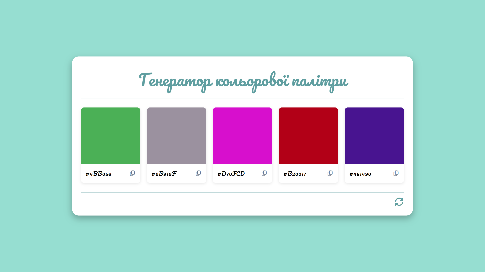

[🇺🇦](./README.uk.md)

# 🎨 Color Palette Generator

### [Live Demo](https://semivate.github.io/color-palette-generator/)

A simple color palette generator built with JavaScript.  
It lets you generate random colors and quickly copy HEX codes to the clipboard.

---

## Features

- Generates a random palette of 5 colors.
- Copy HEX codes with a single click.
- Visual confirmation of copying.
- Animated generate button.
- Changes the page background when a color is selected.
- Minimalist UI.

---

## Technologies Used

- HTML5
- CSS3
- JavaScript (Vanilla JS)
- Font Awesome Icons

---

## Preview

